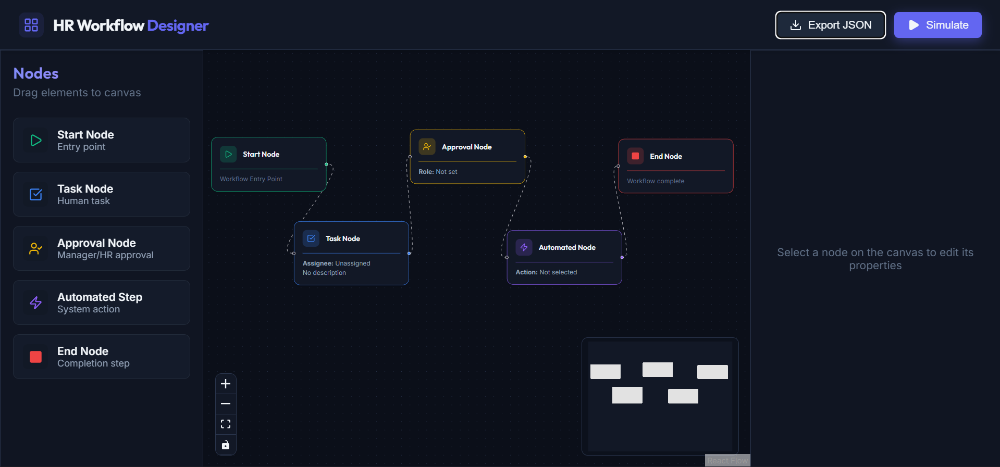
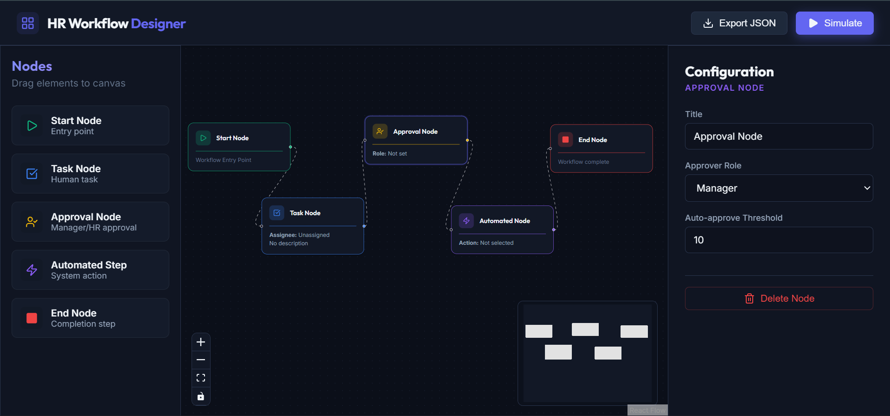
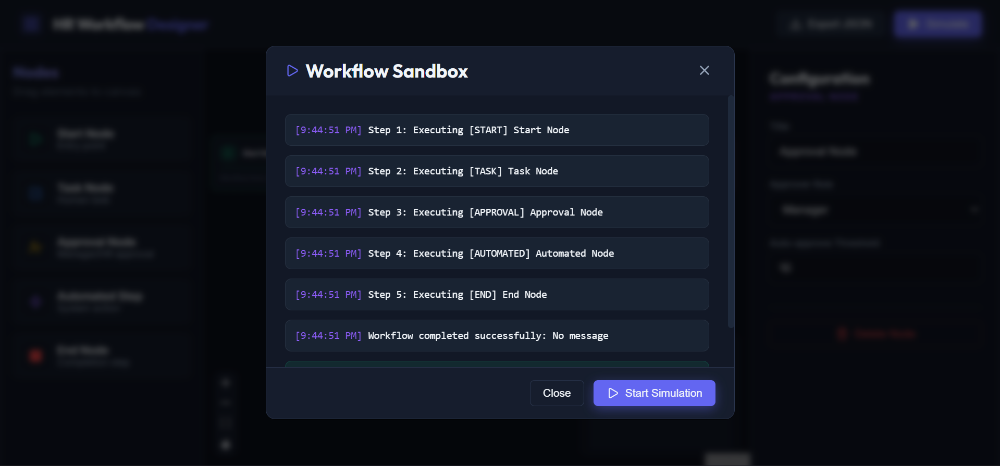
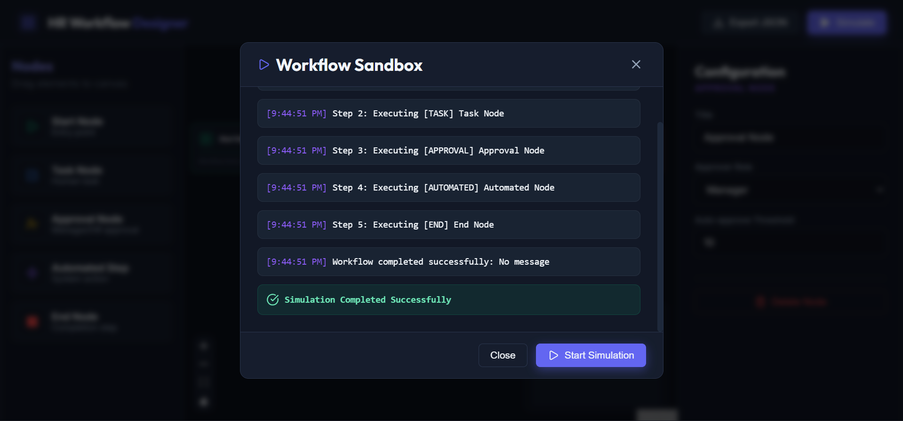

# HR Workflow Designer Prototype

This is a prototype of an HR Workflow Designer Module built with React, React Flow (`@xyflow/react`), and Vanilla CSS. It provides an intuitive canvas for an HR Administrator to map out and test workflows.

## Screenshots

Click to view screenshots

 

**1. Main Workspace & Node Configuration**

**2. Interactive Canvas**

**3. Workflow Sandbox Simulation**

**4. Simulation Success**

## Features Developed

- **React Flow Canvas**: Full layout featuring drag & drop. Includes Start, Task, Approval, Automated, and End Nodes, all uniquely styled and animated.
- **Node Forms**: A dynamic sidebar properties panel updates reactively when selecting any node, exposing specific configuration fields based on the selected node type.
- **Mock API**: Local simulated API requests to fetch automated actions (`getAutomations`) and simulate workflows (`simulateWorkflow`). 
- **Sandbox Simulation Panel**: Click "Simulate" to validate structure, test execution paths, and view execution logs mimicking real timeline processing. 
- **Vanilla CSS Aesthetics**: Built completely with vanilla CSS variables and classes to offer a premium, modern aesthetic without any external utility libraries. 
- **Export Configuration**: Easily get JSON representations of the workflow states.

## Architecture & Choices

1. **State Management**: React Flow's native hook state (`useNodesState` and `useEdgesState`) was used to govern state to reduce dependencies on large boilerplate architectures like Redux, while still keeping state isolated in appropriate boundary contexts. 
2. **Context vs Props**: With a shallow structure (`App` -> `Canvas`, `Properties`, `Sidebar`), passing callbacks down was preferred for simplicity and clarity over implementing Context bindings, making the application easily traceable.
3. **Styling Framework**: Utilizing an `index.css` structure utilizing BEM concepts alongside modern CSS variables allowing robust scalability of themes (e.g. Dark mode, Brand scaling).
4. **Mock API Layer**: Placed in `api/mockApi.ts` returning native promises to mimic asynchronous payload fetches smoothly. It simulates an execution DAG with naive topology mapping for verification. 

## Run Instructions

1. Ensure Node.js & npm are installed. 
2. In the terminal, run `npm install`.
3. Then start the local server with `npm run dev`.

## Future Enhancements
Given additional time, the following enhancements could be incorporated:
1. **Zustand / Redux global store** to manage undo/redo and larger scale application settings cleanly.
2. **Backend Persistance**: Move Mock API implementation to an Express / Prisma backend with a real Postgres Database.
3. **Validation Visuals**: Showing immediate error edges and node highlighting on erroneous simulation configurations.
4. **Enhanced Auto Layouting**: implementing `dagre` library for automatic node placement.
